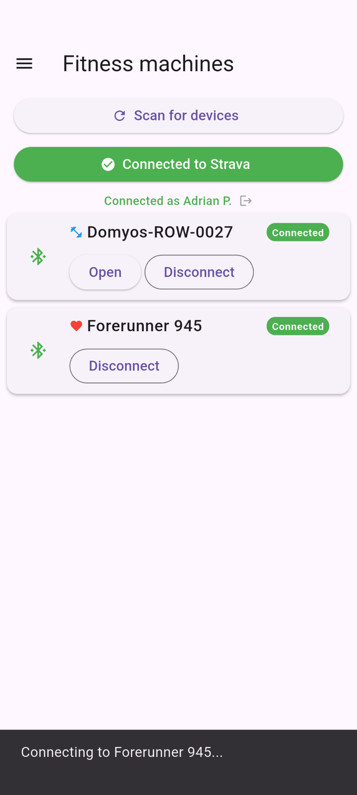
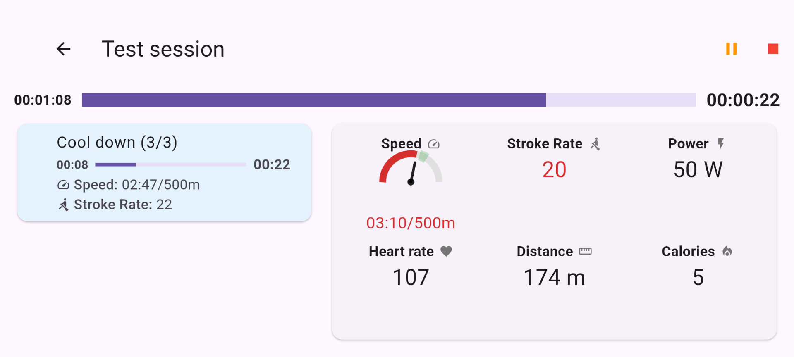
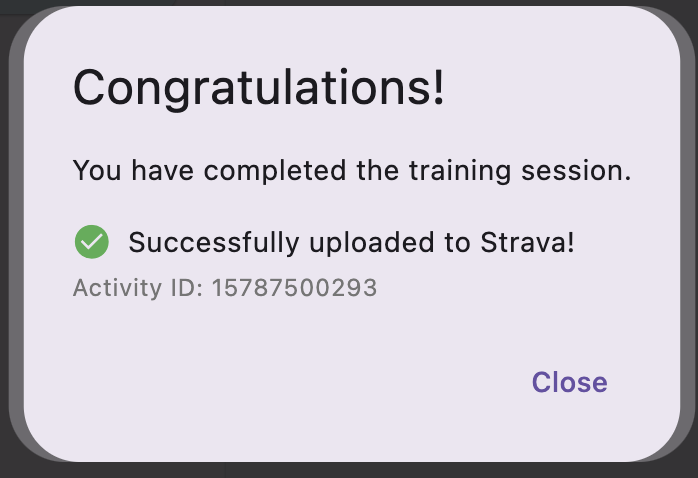
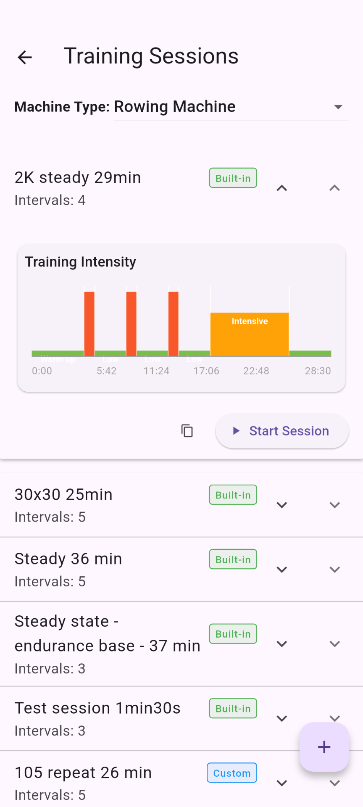
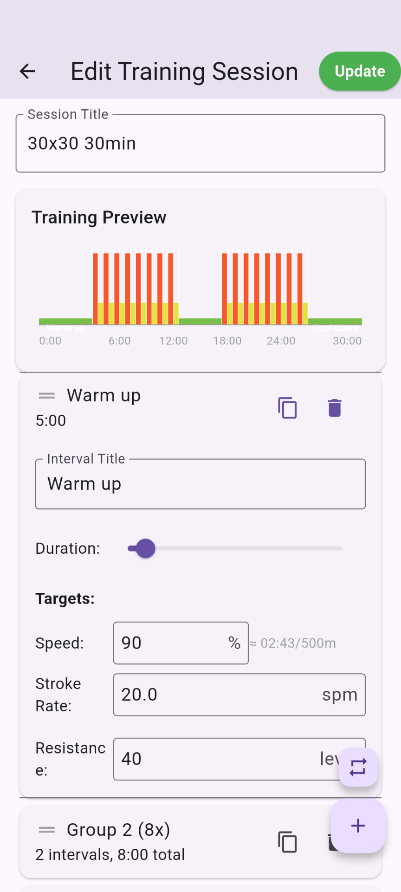
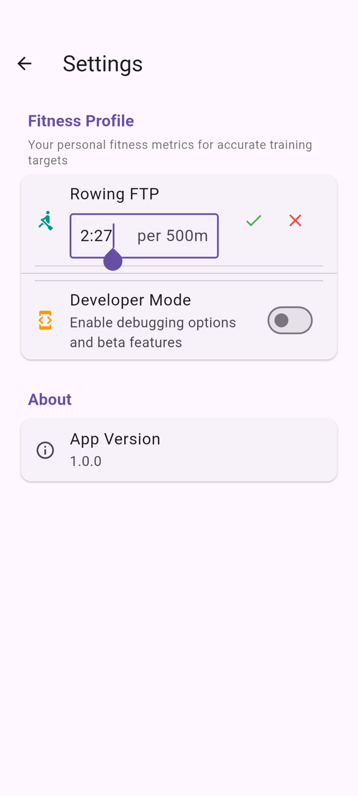

# PowerTrain
FTMS Training App

I started this app because I bought a rowing machine Domyos Woodrower from Decathlon and the free app I was using didn't have the features I wanted and only worked by setting the trainer resistance: 
- target cadence
- target speed

By chance, the rowing machine supports [FTMS bluetooth protocol]([url](https://www.bluetooth.com/specifications/specs/fitness-machine-service-1-0/)) - https://www.bluetooth.com/specifications/specs/fitness-machine-service-1-0/.

I also have a Zwift Hub indoor bike trainer and it's easier to play with it than with the rowing machine because it doesn't go in standby mode after a few minutes of inactivity.


The code is based on [flutter_ftms]([url](https://github.com/Malte2036/flutter_ftms)) - https://github.com/Malte2036/flutter_ftms , a Flutter package for FTMS Bluetooth connectivity. Nice work, BTW, it saves a lot of time for translating complicated hex bluetooth codes into meaningful, human readable data.

# Supported machine types

The machines MUST support the [FTMS bluetooth protocol]([url](https://www.bluetooth.com/specifications/specs/fitness-machine-service-1-0/)).

The application is intended to work primarily with rowers. It definitely works with Domyos Woodrower but should work with other FTMS rowers as well.

The application also supports indoor bikes supporting the FTMS protocol. It has been tested with a Zwift Hub trainer.

External bluetooth heart rate monitors are supported.

For indoor bikes you can pair a cadence sensor as well.

# Disclaimer
This is a personal project. Use it at your own risk. If you browse the code, you might see pieces of code that are not very clean or not covered by tests. That's all right, it's my playground. I don't have time to make it perfect, but I try to keep it working. Again, feedback is appreciated.

## Screenshots










## Main Features

- **Bluetooth Connectivity**: scan for, connect to and display data from FTMS-compatible fitness machines (bikes and rowers) using Bluetooth Low Energy (BLE).
- **Heart rate monitoring**: connect to heart rate monitors (HRMs) via Bluetooth and display real-time heart rate data.
- **Cadence sensors** for indoor bikes: connect to cadence sensors via Bluetooth and display real-time heart cadence data.
- **Bluetooth autoconnect**: when the application starts it automatically connects to the last known devices (fitness machine or sensors).
- **Structured Training Sessions**: load and execute interval-based training sessions with support for both simple and grouped intervals. Visual progress bar and detailed feedback during workouts, including interval targets and completion status.
- **Edit your own training sessions**: create and modify training sessions. Data stored locally in JSON format.
- **Strava upload or FIT file generation**: If connected to Strava, the workout is automatically uploaded at the end of the session. If not connected to Strava, a FIT file is generated and stored locally for manual upload later or sharing with other apps.

For build, test, and usage instructions, see the rest of this README.

## The resistance level

The rower I have can be controlled by the app. When editing a training session, for each interval you can set a target resistance level. I don't know what values are accepted by other rowers but you can try different values.

For testing, activate developer mode in the settings. Then connect to the machine and you'll see a menu "Machine features". You can try different resistance levels there. Don't forget to request control first.

In my case, the number must be the resistance level displayed on the rower multiplied by 10. The rower has 15 resistance levels, so the value that the app transmits to the rower can be 10, 20, ..., 150. Yours ... I don't know.

For home trainers, the resistance is a percentage from 0 to 100.

## Getting Started

### Prerequisites
- [Flutter SDK](https://flutter.dev/docs/get-started/install) 
- Java 21 for Android builds
- Android Studio and/or Xcode for mobile builds (I'm on a Mac M4, I don't really know if it works on other platforms)
- Bluetooth activated on your device

### Install Dependencies
```zsh
flutter pub get
```

### Build and Run

#### Android (on a test phone)
1. Connect your Android device via USB and enable developer mode.
2. Build and install the APK for dev:
   ```zsh
   flutter build apk --release
   flutter run -d <device_id> -PdevBuild
   ```
The Android device ID can be found with `flutter devices`. It must be in developer mode.

   ```zsh
   flutter devices
   flutter install -d <device_id> -PdevBuild
   ```
Sometimes you'll need to kill the adb server:
    ```
    adb kill-server
    ```

#### macOS
```zsh
flutter run -d macos
```

## Running Tests
```zsh
flutter pub run build_runner build --delete-conflicting-outputs
flutter test
```

## Static Analysis
```zsh
flutter analyze
```

## Continuous Integration
CI is set up with GitHub Actions: see `.github/workflows/flutter_ci.yml` for build, analyze, and test jobs.

## Training Sessions
- Training sessions are defined as JSON files in `lib/training-sessions/`.
- Supports nested intervals (unit/group) and custom targets.

## Permissions
- **Android:** Requires Bluetooth and location permissions (see `AndroidManifest.xml`).
- **macOS/iOS:** Requires Bluetooth permissions in Info.plist.

## License
It's free to fork and use, but please don't use it for commercial purposes without asking me first.
